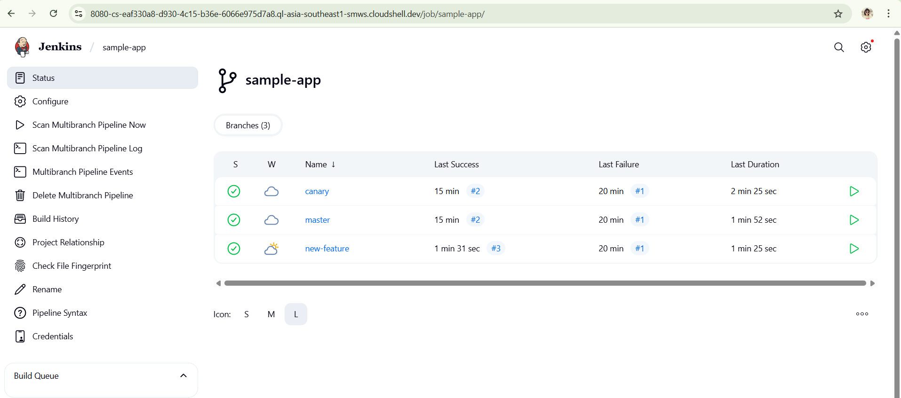
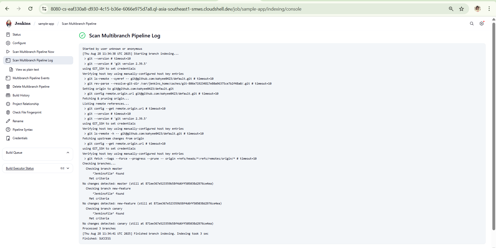

## Jenkins Multibranch Pipeline Setup

This project demonstrates a **Jenkins Multibranch Pipeline** connected to a Go application (`main.go`).  
The pipeline automatically detects all Git branches, builds them, and runs the defined CI/CD stages based on the `Jenkinsfile`.  

The Go app (`main.go`) is a simple HTTP service that can run in either **backend mode** (returning JSON with instance metadata and request details) or **frontend mode** (rendering HTML output by calling the backend).  
It includes:
- A `/version` endpoint that returns the app version (`2.0.0`)
- A `/healthz` endpoint for health checks
- Metadata fetching when running on Google Cloud (GCE)

Screenshots below show the Jenkins Multibranch Dashboard and the Scan Pipeline Log.

### Dashboard

This shows the Jenkins Multibranch Pipeline dashboard where all GitHub branches 
(`master`, `canary`, `new-feature`) are automatically discovered and built.

### Scan Log

This shows the indexing log where Jenkins scans the GitHub repository, 
detects branches with `Jenkinsfile`, and sets up individual branch pipelines.
